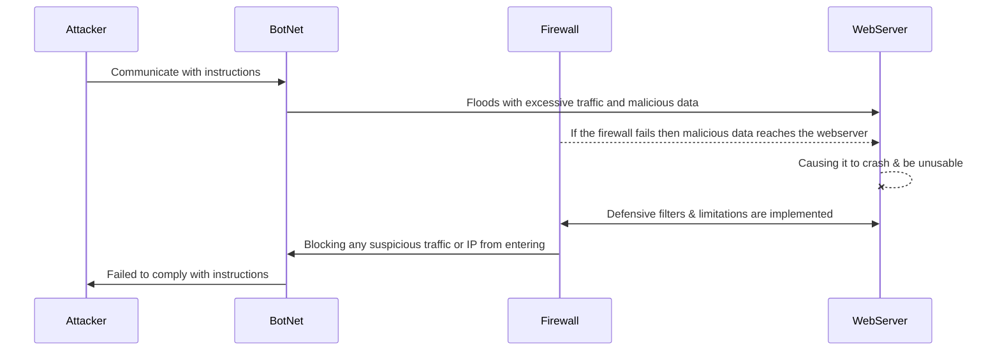

# kjbanegas.github.io
Kevin Banegas Gamoneda 
kjbanegasgamoneda@my.waketech.edu
This is my school account
This repository will hold assignments 

# About Me
## I like to work out, play video games, and spend time with family and friends. I also enjoy watching TV shows and movies.
## Websites I recommend

* [Disney Plus](www.disneyplus.com) - I like Disney Plus because it is one of the streaming platforms I use to watch TV shows and movies. 
* [Best Buy](www.disneyplus.com) - I shop at Best Buy for gaming needs from newly released games to graphic cards for my PC. 

# Lab 2 

## DDos Attack & Defense Diagram

## Decription

### Attack:

* The Attacker will use BotNet to carry out their attack. They instruct the BotNet to send malicious info to WebServer.
* The BotNet will then try to bypass the Firewall to flood the Webserver with excessive traffic and malicious data 
* Once the excessive traffic and malicious data reach the WebServer, it will cause it to crash and be unusable.
* These attacks can lead to the following 
	* Loss of revenue
	* Loss of private information 
	* Damage to reputation
 	* Etc.

### Defense:

* The Firewall will prevent the BotNet from sending excessive traffic and malicious info to the WebServer.
* The Firewall uses techniques like the following
	* Traffic Filtering 
	* Rate Limiting 
	* IP Blocking 
	* Password Changing 
	* Etc. 
* This will prevent the BotNet from following the Attacker's orders and prevent a DDoS Attack.
